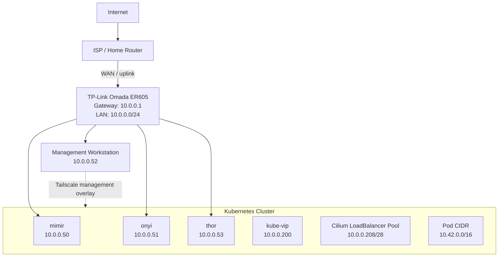
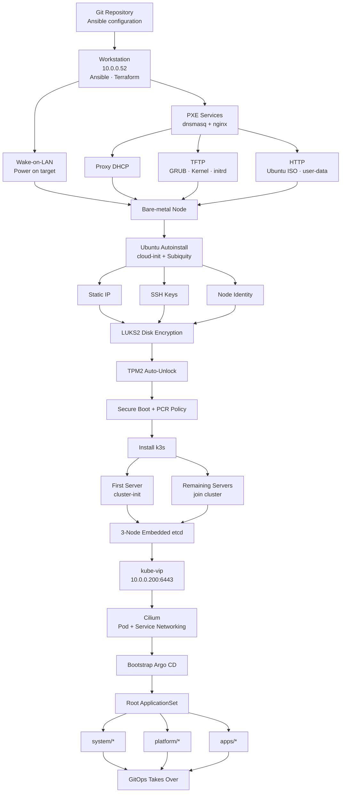
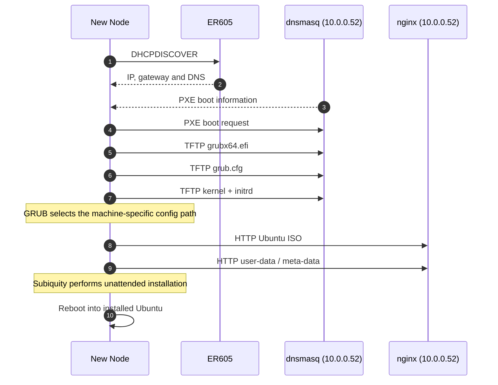
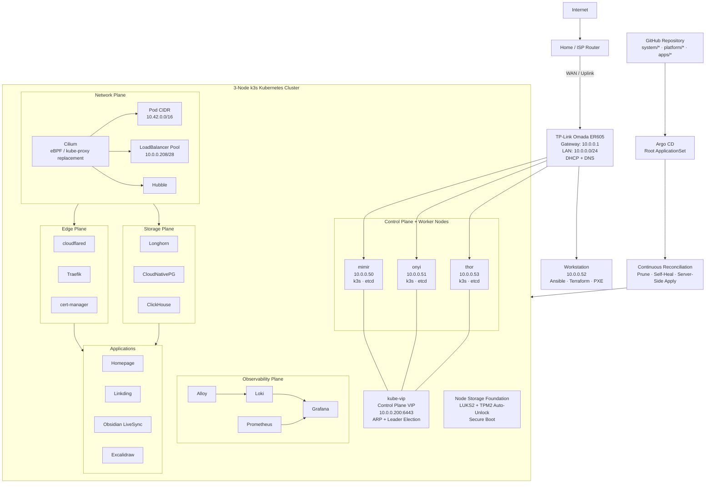
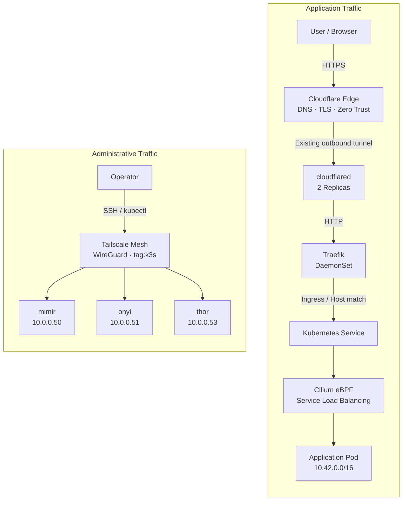
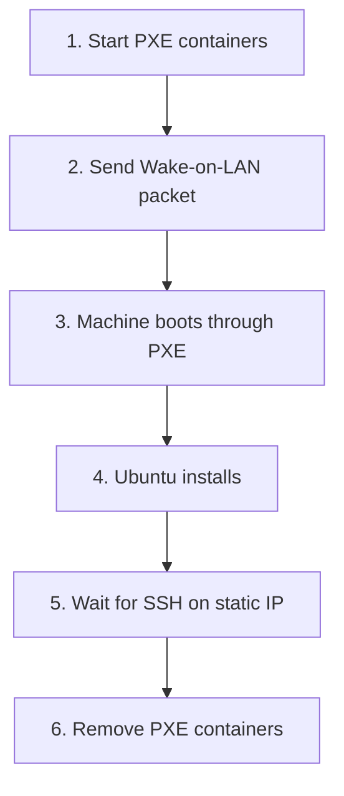

# Homelab Kubernetes Platform

A three-node bare-metal Kubernetes homelab with automated node provisioning, high-availability control-plane access, eBPF networking, GitOps, encrypted storage, private administration and outbound-only application ingress.

The infrastructure is designed so a powered-off and empty bare-metal node can be provisioned to a GitOps-managed Kubernetes cluster without a USB installer or manual operating-system setup.

## What this project demonstrates

- bare-metal provisioning with Wake-on-LAN, PXE, TFTP, HTTP and Ubuntu Autoinstall.
- Ansible-driven OS and k3s bootstrap.
- LUKS2 disk encryption with TPM2-assisted unattended boot.
- three-server k3s with embedded etcd.
- kube-vip for a highly available control-plane endpoint.
- Cilium for Pod networking, eBPF Service load balancing and L2 `LoadBalancer` advertisements.
- Argo CD for GitOps reconciliation.
- Cloudflare Tunnel for public application access without inbound router port-forwarding.
- Tailscale for private SSH and Kubernetes administration.
- Longhorn for replicated persistent storage.
- Prometheus, Loki, Alloy, Grafana and Hubble and Clickhouse for observability.


# Architecture

## Network architecture

All devices are on the same `10.0.0.0/24` subnet, with no VLAN seperation. Both load balancers (kube-vip and Cilium) advertise their IP addresses using Address Resolution Protocol (ARP) and their announcement are visible across the same local network.

Both kube-vip and Cilium advertise addresses using ARP. Their advertisements are visible across the local LAN because ARP is a Layer-2 protocol and does not cross routed subnet boundaries.


### Network summary

| Address / range | Purpose |
|---|---|
| `10.0.0.0/24` | homelab LAN |
| `10.0.0.1` | ER605 gateway, DHCP and DNS |
| `10.0.0.50` | `mimir` |
| `10.0.0.51` | `onyi` |
| `10.0.0.52` | management workstation |
| `10.0.0.53` | `thor` |
| `10.0.0.200` | kube-vip control-plane VIP |
| `10.0.0.208/28` | Cilium `LoadBalancer` pool |
| `10.42.0.0/16` | Kubernetes Pod CIDR |

kube-vip and Cilium both use Layer-2 advertisement on the LAN, but their responsibilities do not overlap: kube-vip owns the Kubernetes API VIP, while Cilium owns application `LoadBalancer` addresses.

---

## Provisioning and bootstrap

The below diagram describes the node setup flow from an empty bare metal to a GitOps-managed platform. The workstation provides the temporary PXE services, Ansible is used for the installation, k3s for the three-node control plane, and Argo CD for gitops.


## PXE boot chain

A new node starts in its UEFI PXE environment and broadcasts a DHCP request. The ER605 supplies normal network configuration, while `dnsmasq` on the workstation operates in Proxy DHCP mode and provides PXE boot information.

The node then retrieves a network-enabled GRUB image and the Ubuntu kernel/initrd (initial ram disk) over TFTP. Once Linux is running, the installer switches to HTTP for the large Ubuntu ISO and the per-machine autoinstall configuration.



---


## Platform architecture

The below diagram shows the high level platform architecture consisting of the physical LAN and workstation, the three-node k3s/etcd cluster, the control-plane VIP, the major Kubernetes platform planes, the encrypted storage foundation and the GitOps control path.




## Traffic flow

Application traffic and administrative traffic are separated. Public applications use Cloudflare Tunnel, workstation reaches the nodes using tailscale.



**Application path:** `Browser → Cloudflare → cloudflared → Traefik → Service → Cilium → Pod`

**Workstation path:** `Engineer → Tailscale → k3s nodes`

The Cloudflare tunnel is established outbound from the cluster, so public applications do not require an inbound router port-forward. Tailscale provides a separate private management path for SSH and Kubernetes administration.

---


# GitOps

Ansible bootstraps Argo CD once. From that point, the repository is authoritative for Kubernetes state.

The root ApplicationSet scans:

```text
system/*
platform/*
apps/*
```

and generates one Argo CD Application per directory.

Automated synchronization uses pruning and self-healing so resources removed from Git are removed from the cluster and manual drift is reconciled back to the desired state.

---

# Storage

Longhorn is the default Kubernetes StorageClass and normally keeps two replicas of each volume across the three nodes.

Node disks are encrypted with LUKS2 underneath Longhorn, so persistent cluster data ultimately lands on encrypted storage.

ClickHouse uses a hot/cold storage policy:

```text
Longhorn -> hot tier
S3       -> cold tier
```

`linkding` uses a dedicated single-replica StorageClass with `Retain` reclaim policy where lower capacity usage is preferred over node-failure tolerance.

---

# Observability

The observability stack is:

```text
Metrics -> Prometheus -> Grafana
Logs    -> Alloy -> Loki -> Grafana
Events  -> Alloy -> Loki
Network -> Cilium / Hubble
```

Loki uses a deliberately small label set based on namespace, pod and container to limit stream cardinality.

---

# Security model

The platform combines several layers:

- UEFI Secure Boot.
- LUKS2 encrypted node disks.
- TPM2-backed automatic root unlock.
- recovery LUKS passphrase retained separately.
- SSH key authentication with password SSH disabled.
- Ansible Vault for provisioning secrets.
- Kubernetes Secret encryption in the k3s datastore.
- no inbound application port-forwarding on the home router.
- Cloudflare Zero Trust for public application access.
- Tailscale for private infrastructure administration.

TPM auto-unlock is primarily an availability/security trade-off: it keeps encrypted nodes capable of unattended reboot while preserving a separate recovery passphrase.

---

# Core stack

| Area | Technology |
|---|---|
| Bare-metal automation | Ansible, Wake-on-LAN, PXE, dnsmasq, nginx |
| Operating system | Ubuntu Server |
| Kubernetes | k3s |
| HA API | kube-vip |
| Networking | Cilium / eBPF |
| Network observability | Hubble |
| GitOps | Argo CD |
| Ingress | Traefik |
| Public edge | Cloudflare Tunnel |
| Administrative access | Tailscale |
| Certificates | cert-manager |
| Persistent storage | Longhorn |
| Databases | CloudNativePG, ClickHouse |
| Metrics | Prometheus |
| Logs | Loki + Alloy |
| Dashboards | Grafana |

---

# Repository model

The GitOps root ApplicationSet discovers workloads from:

```text
system/
platform/
apps/
```

`system/` contains foundational cluster services such as Argo CD and ingress components.

`platform/` contains shared platform capabilities such as storage, observability and databases.

`apps/` contains user-facing applications.

The detailed bare-metal and cluster bootstrap configuration lives outside the GitOps lifecycle and is executed from the management workstation before Argo CD takes ownership of Kubernetes resources.

---

# Ansible

Ansible is used to automate the bare-metal provisioning and Kubernetes bootstrap process.

The automation is split into two main stages:

1. provision the physical nodes and install Ubuntu;
2. configure the nodes and build the k3s cluster.

The provisioning workflow handles Wake-on-LAN, PXE boot, Ubuntu Autoinstall, static networking, disk encryption and SSH access. Once the nodes are reachable on their permanent IP addresses, the cluster playbook installs and configures k3s, kube-vip and Cilium.

---

## Install Ansible dependencies

```bash
ansible-galaxy collection install -r requirements.yml
```

Installs the Ansible collections required by the playbooks.

---

## Check the inventory

```bash
# copy inventory and customize to fit your setup
cp metal/inventories/prod.yml.example metal/inventories/prod.yml

ansible-inventory -i metal/inventories/prod.yml  --graph
```

Shows the hosts and groups Ansible can see before running any playbooks.

The inventory contains the three Kubernetes nodes:

```text
@all:
  |--@ungrouped:
  |--@metal:
  |  |--onyi
  |  |--mimir
  |  |--thor
  |--@masters:
  |  |--onyi
  |  |--thor
  |  |--mimir

```

---

## Test connectivity

```bash
ansible all -i metal/inventories/prod.yml -m ping
```

Checks that Ansible can connect to the installed nodes over SSH and execute commands.

This is an Ansible connectivity test.

---

## Bare-metal provisioning

Run the provisioning playbook:

```bash
ansible-playbook -i metal/inventories/prod.yml --ask-vault-pass --ask-become-pass
```

Replace `<provisioning-playbook>.yml` with the actual provisioning playbook name.

The provisioning workflow performs:



The PXE services run from the management workstation at `10.0.0.52` and are only started during provisioning.

Each node receives its machine-specific configuration based on its MAC address.

---

## Kubernetes cluster bootstrap

Once all nodes are installed and reachable over SSH, run:

```bash
ansible-playbook cluster.yml --ask-vault-pass --ask-become-pass
```

The first server creates the cluster using `cluster-init`.

The remaining two servers then join using the shared k3s token.

kube-vip provides the Kubernetes control-plane endpoint:

```text
https://10.0.0.200:6443
```

Cilium is installed after the control plane is available and provides:

- Pod networking;
- eBPF Service load balancing;
- kube-proxy replacement;
- LoadBalancer IP allocation;
- Layer-2 announcements;
- Hubble network observability.

---


## Run against a single node

A playbook can be limited to one node:

```bash
ansible-playbook cluster.yml --limit mimir --ask-vault-pass --ask-become-pass
```

The same can be done for `onyi` or `thor`.

This is useful for node-specific maintenance or troubleshooting.

Use `--limit` only with tasks that are safe to run against a subset of the cluster.

---

## Check playbook syntax

```bash
ansible-playbook  cluster.yml --syntax-check
```

Checks the playbook for syntax errors without making any changes.

---

## Preview changes

```bash
ansible-playbook cluster.yml --check --ask-vault-pass --ask-become-pass
```

Runs Ansible in check mode and shows what it expects to change without applying most changes.

> Some provisioning, container and Kubernetes modules do not fully support check mode, so this should not be treated as a complete simulation.

---

## Run with additional debugging output

```bash
ansible-playbook  cluster.yml --ask-vault-pass -vv
```

Runs the playbook with more detailed output for troubleshooting.

Available verbosity levels are:

```text
-v
-vv
-vvv
-vvvv
```

For normal troubleshooting, `-vv` is usually enough.

---
## Acknowledgements

Inspired by [khuedoan/homelab](https://github.com/khuedoan/homelab).